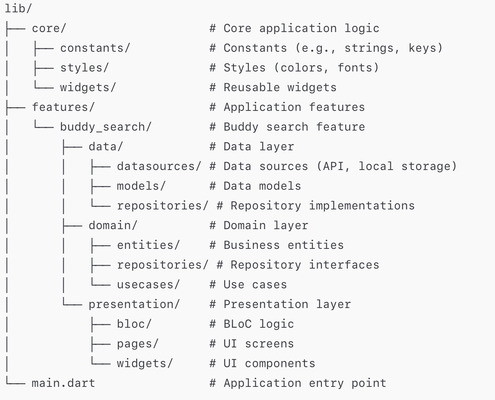

# 📱 Buddy Search Clean Architecture BLoC

**Buddy Search** is a demonstration Flutter application created to illustrate the principles of Clean Architecture and the use of the BLoC pattern for state management. The primary goal of the project is to show how to structure a Flutter application by dividing it into data, domain, and presentation layers, ensuring modularity, testability, and scalability.

---

## 🏗 Application Architecture

The project is divided into three main layers:

### 1. Presentation Layer
- **Components**: Widgets, pages, BLoC.
- **Responsibility**: Displaying UI and handling user interactions.

### 2. Domain Layer
- **Components**: Entities, use cases, repositories.
- **Responsibility**: Business logic and application rules.

### 3. Data Layer
- **Components**: Data sources, models, repository implementations.
- **Responsibility**: Managing data and interacting with external sources.
- 
---

## 🔄 Data Flow Between Layers

1. **Presentation Layer** initiates requests through BLoC.
2. **BLoC** interacts with corresponding **Use Cases** from the domain layer.
3. **Use Cases** access repository interfaces defined in the domain layer.
4. **Repository Implementations** in the data layer interact with specific data sources (e.g., API).
5. **Data** is returned through the layers to the presentation layer, where it's displayed to the user.

---

## 🧱 Project Structure

